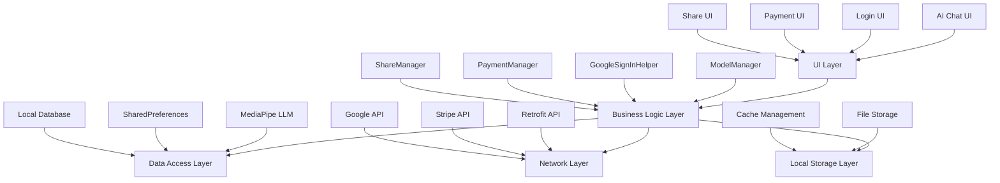

# Another-Me - AI 聊天应用完整文档


**智能 AI 聊天应用 - 本地 AI 推理，隐私安全，功能丰富**

[](https://developer.android.com/)
[](https://kotlinlang.org/)
[](LICENSE)
[]()

[中文文档](README_ANOTHERME.md) | [English Documentation](README_ANOTHERME_EN.md)

</div>

## 📱 项目概述

Another-Me 是一个基于 Android 平台的智能 AI 聊天应用，集成了本地 AI 模型推理、多平台用户认证、订阅支付系统、社交媒体分享等功能。应用采用现代 Android 开发架构，为用户提供安全、私密且功能丰富的 AI 对话体验。

### 🎯 核心价值

- **🔒 隐私与安全**: 本地 AI 模型推理，用户数据保留在设备上
- **⚡ 高性能**: 基于 MediaPipe 优化的推理引擎
- **🌐 多平台**: 支持 Google、Facebook 等社交登录
- **💳 完整支付**: 集成 Stripe 支付系统，支持订阅功能
- **📤 社交分享**: 多平台内容分享功能
- **🎨 现代 UI**: 流式响应显示，优雅的用户界面

## 目录

- [核心功能模块](#-核心功能模块)
- [技术架构](#-技术架构)
- [主要 Activity 详解](#-主要-activity-功能详解)
- [技术特性](#-技术特性)
- [项目统计](#-项目统计)
- [开发环境要求](#-开发环境要求)
- [快速开始](#-快速开始)
- [功能演示](#-功能演示)
- [故障排除](#-故障排除)
- [贡献指南](#-贡献指南)

## ✨ 核心功能模块

### 🤖 AI 聊天系统

- **本地 AI 推理**: 使用 MediaPipe LLM Inference 进行本地模型推理
- **流式响应**: AI 响应的实时显示，提升用户体验
- **智能回退**: 当本地模型不可用时自动切换到模拟响应模式
- **Token 管理**: 智能的 token 消耗计算和计费系统
- **多轮对话**: 支持上下文感知的连续对话

### 🔐 用户认证系统

- **Google 登录**: 使用最新的 Credential Manager API
- **安全存储**: 用户信息的本地加密存储
- **自动登录**: 智能的登录状态检查和自动登录
- **多账户支持**: 支持多个 Google 账户切换

### 💰 支付与订阅系统

- **Stripe 集成**: 使用 PaymentSheet 进行安全的支付处理
- **多层级订阅**: 基础版、高级版和超级高级版
- **WebView 回退**: 支持 WebView 支付作为备选方案
- **订单管理**: 完整的订单创建和支付流程

### 📱 社交媒体分享

- **Twitter 分享**: 集成 Twitter SDK 进行推文分享
- **Facebook 分享**: 集成 Facebook SDK 进行帖子分享
- **Kakao 分享**: 集成 Kakao SDK 进行 KakaoTalk 分享
- **统一接口**: 提供统一的分享接口，便于集成

### 🎮 游戏化元素

- **Token 挖矿**: 用户通过聊天获得 Token 奖励
- **排行榜系统**: 用户排名和竞争机制
- **邀请奖励**: 邀请好友获得额外奖励
- **KYC 验证**: 身份验证系统

### 🎨 用户等级系统

| 等级 1                                                                                 | 等级 2                                                                 | 等级 3                                                                   | 等级 4                                                                  | 等级 5                                                                  |
|:------------------------------------------------------------------------------------:|:--------------------------------------------------------------------:|:----------------------------------------------------------------------:|:---------------------------------------------------------------------:|:---------------------------------------------------------------------:|
|  |  |  |  |  |

| 等级 6                                                                 | 等级 7                                                                   | 等级 8                                                                   | 等级 9                                                                  | 等级 10                                                                 |
|:--------------------------------------------------------------------:|:----------------------------------------------------------------------:|:----------------------------------------------------------------------:|:---------------------------------------------------------------------:|:---------------------------------------------------------------------:|
|  |  |  |  |  |

</div>

## 🏗️ 技术架构

### 功能模块结构

```
app/src/main/java/com/another/network/activity/
├── account/          # 账户管理模块
├── activate/         # 激活功能模块  
├── aichat/          # AI 聊天核心模块
├── dashboard/       # 仪表板主界面
├── invite/          # 邀请系统模块
├── login/           # 用户登录模块
├── mine/            # 个人中心模块
└── userchat/        # 用户聊天模块
```

### 系统架构图



### 核心组件

#### 1. AI 推理引擎

- **ModelManager**: 模型生命周期管理
- **LlmInference**: MediaPipe LLM 推理接口
- **SimulatedResponseManager**: 模拟响应管理器

#### 2. 用户认证

- **ANLoginActivity**: Google 登录主界面
- **GoogleSignInHelper**: 用户信息管理工具
- **CredentialManager**: Google 认证管理器

#### 3. 支付系统

- **ANSubscriptionActivity**: 订阅支付界面
- **Stripe SDK**: 支付处理服务
- **PaymentSheet**: 支付界面组件

#### 4. 网络通信

- **Retrofit**: HTTP 客户端
- **RxJava**: 异步编程框架
- **OkHttp**: 网络请求拦截器

## 📱 主要 Activity 功能详解

### 🏠 主界面模块

#### 1. ANDashBoardActivity - 仪表板

**功能**: 应用主界面，显示用户统计数据和全局信息

**特性**:

- 视频背景播放（使用 ExoPlayer）
- 用户 AP（Activity Points）统计
- Token 挖矿数据展示
- 全局用户和 Token 统计
- 底部导航栏集成

#### 2. ANAiChatActivity - AI 聊天

**功能**: 核心 AI 聊天界面

**特性**:

- 本地 MediaPipe LLM 推理
- 流式响应显示
- 智能回退到模拟响应
- Token 消耗计算
- 多轮对话支持
- 实时分数动画

#### 3. ANTokensGeneratedActivity - Token 生成

**功能**: Token 挖矿和生成界面

**特性**:

- 实时 Token 生成统计
- 在线状态指示器
- 运行时间计时器
- 每日剩余时间倒计时
- 问题列表展示
- 波浪图表显示

### 👤 用户管理模块

#### 4. ANAccountActivity - 账户管理

**功能**: 用户账户信息管理

**特性**:

- 用户信息展示
- 订阅管理
- 社交媒体分享功能
- KYC 验证入口
- 设置选项

#### 5. ANLoginActivity - 登录界面

**功能**: 用户登录认证

**特性**:

- Google 登录集成
- 自动登录检查
- 用户信息存储
- 登录状态管理

#### 6. ANMineActivity - 个人中心

**功能**: 个人中心界面

**特性**:

- KYC 身份验证
- 个人信息管理
- 设置选项

### 💬 聊天模块

#### 7. ANUserChatActivity - 用户聊天

**功能**: 用户间聊天界面

**特性**:

- 实时聊天功能
- 消息历史记录
- 输入状态管理
- 键盘适配

### 🎁 邀请模块

#### 8. ANInviteActivity - 邀请系统

**功能**: 用户邀请和推荐系统

**特性**:

- 邀请链接生成
- 邀请码分享
- 排行榜展示
- 邀请奖励统计
- 海报生成功能

#### 9. ANInviteCreatePosterActivity - 邀请海报

**功能**: 生成邀请海报

**特性**:

- 自定义海报设计
- 二维码生成
- 图片保存和分享

### 💰 支付模块

#### 10. ANSubscriptionActivity - 订阅管理

**功能**: 订阅和支付管理

**特性**:

- 多层级订阅选择
- Stripe 支付集成
- WebView 支付备选
- 订单状态管理

### 🔧 工具模块

#### 11. ANWebViewActivity - WebView 界面

**功能**: 内嵌网页显示

**特性**:

- 支付页面显示
- 外部链接处理
- 网页与原生交互

#### 12. ANKYCActivity - KYC 验证

**功能**: 身份验证

**特性**:

- Persona SDK 集成
- 身份验证流程
- 验证结果处理

#### 13. ANActivateActivity - 功能激活

**功能**: 功能激活管理

**特性**:

- 激活码验证
- 功能解锁
- 激活状态管理

#### 14. ANCollectTokenActivity - Token 收集

**功能**: Token 收集管理

**特性**:

- Token 收集界面
- 收集历史记录
- 奖励统计

#### 15. ANInitModelActivity - 模型初始化

**功能**: AI 模型初始化

**特性**:

- 模型下载管理
- 初始化进度显示
- 错误处理

#### 16. ANTokensContentActivity - Token 内容

**功能**: Token 内容管理

**特性**:

- Token 详情展示
- 使用记录
- 余额管理

#### 17. ANReLoginActivity - 重新登录

**功能**: 重新登录处理

**特性**:

- 会话过期处理
- 自动重新认证
- 状态恢复

## 🚀 技术特性

### 本地 AI 推理

- **MediaPipe LLM**: 使用 Google MediaPipe 进行本地 AI 推理
- **模型管理**: 智能的模型下载、初始化和生命周期管理
- **性能优化**: 针对移动设备的推理优化
- **回退机制**: 当本地推理不可用时自动切换到云端服务

### 现代化 UI/UX

- **Material Design**: 遵循 Material Design 设计规范
- **响应式布局**: 适配不同屏幕尺寸
- **流畅动画**: 丰富的交互动画效果
- **暗色主题**: 支持暗色主题切换
- **卡片堆叠效果**: 自定义 StackLayoutManager 实现平滑堆叠动画

### 数据管理

- **本地存储**: SharedPreferences 和 SQLite 数据库
- **网络缓存**: 智能的网络请求缓存机制
- **数据同步**: 本地和云端数据同步
- **隐私保护**: 用户数据的本地加密存储

### 第三方集成

- **Google 服务**: Google 登录、Google Play 服务
- **Stripe 支付**: 安全的支付处理
- **社交媒体**: Twitter、Facebook、Kakao 分享
- **分析工具**: 用户行为分析和统计
- **Persona SDK**: KYC 身份验证

## 📊 项目统计

### 代码规模

- **总文件数**: 231+ Java/Kotlin 文件
- **主要 Activity**: 17 个核心 Activity
- **核心功能模块**: 8 个
- **第三方库**: 20+ 个集成库
- **资源文件**: 391+ 个资源文件

### 技术栈

- **开发语言**: Kotlin (主要) + Java
- **UI 框架**: Android View System + Data Binding + ViewBinding
- **网络框架**: Retrofit + RxJava + OkHttp
- **图片加载**: Glide
- **数据库**: SQLite + SharedPreferences
- **AI 推理**: MediaPipe LLM
- **支付**: Stripe SDK
- **社交**: Twitter SDK, Facebook SDK, Kakao SDK
- **视频播放**: ExoPlayer

### 功能覆盖

- ✅ AI 聊天对话
- ✅ 用户认证登录
- ✅ 订阅支付系统
- ✅ 社交媒体分享
- ✅ 邀请奖励系统
- ✅ KYC 身份验证
- ✅ Token 管理系统
- ✅ 多语言支持
- ✅ 暗色主题支持
- ✅ 离线模式

### 支持平台

- **登录方式**: Google, Facebook, Kakao
- **分享平台**: Twitter, Facebook, KakaoTalk
- **支付方式**: Stripe, WebView

### 🧭 底部导航栏

| 仪表板                                                                                                                                     | AI 聊天                                                                                                                    | 邀请系统                                                                                                                           | 账户管理                                                                                                                              |
|:---------------------------------------------------------------------------------------------------------------------------------------:|:------------------------------------------------------------------------------------------------------------------------:|:------------------------------------------------------------------------------------------------------------------------------:|:---------------------------------------------------------------------------------------------------------------------------------:|
|   |   |   |   |
| 普通/选中状态                                                                                                                                 | 普通/选中状态                                                                                                                  | 普通/选中状态                                                                                                                        | 普通/选中状态                                                                                                                           |

</div>

## 🔧 开发环境要求

### 系统要求

- **Android Studio**: Arctic Fox 2020.3.1 或更高版本
- **JDK**: 1.8 或更高版本
- **Android SDK**: API 26 (Android 8.0) 或更高
- **Gradle**: 8.11.0
- **Kotlin**: 1.9.25

### 依赖库配置

```gradle
// 核心依赖
implementation 'androidx.appcompat:appcompat:1.6.1'
implementation 'androidx.recyclerview:recyclerview:1.3.0'
implementation 'androidx.lifecycle:lifecycle-runtime-ktx:2.7.0'
implementation 'androidx.constraintlayout:constraintlayout:2.1.4'

// 网络请求
implementation 'com.squareup.retrofit2:retrofit:2.9.0'
implementation 'com.squareup.retrofit2:converter-gson:2.9.0'
implementation 'com.squareup.retrofit2:adapter-rxjava2:2.9.0'
implementation 'io.reactivex.rxjava2:rxjava:2.2.21'
implementation 'io.reactivex.rxjava2:rxandroid:2.1.1'
implementation 'com.squareup.okhttp3:okhttp:4.11.0'
implementation 'com.squareup.okhttp3:logging-interceptor:4.11.0'

// AI 推理
implementation 'com.google.mediapipe:tasks-genai:0.10.14'
implementation 'com.google.mediapipe:mediapipe_aar:0.10.0'

// 支付
implementation 'com.stripe:stripe-android:20.25.0'

// 用户认证
implementation 'androidx.credentials:credentials:1.2.0'
implementation 'com.google.android.libraries.identity.googleid:googleid:1.1.0'
implementation 'com.google.android.gms:play-services-auth:20.7.0'

// 社交分享
implementation 'com.twitter.sdk.android:twitter:3.3.0'
implementation 'com.facebook.android:facebook-android-sdk:16.0.0'
implementation 'com.kakao.sdk:v2-all:2.15.0'

// 图片加载
implementation 'com.github.bumptech.glide:glide:4.15.1'
annotationProcessor 'com.github.bumptech.glide:compiler:4.15.1'

// 视频播放
implementation 'com.google.android.exoplayer:exoplayer:2.19.1'

// KYC 验证
implementation 'com.withpersona.sdk2:inquiry:2.0.0'

// 工具库
implementation 'com.google.code.gson:gson:2.10.1'
implementation 'org.xutils:xutils:3.9.0'
```

## 📱 功能演示

### 应用界面预览

### AI 聊天功能

1. **启动应用** → 进入 AI 聊天界面
2. **输入消息** → 发送给 AI 模型
3. **实时响应** → 查看流式 AI 回复
4. **Token 奖励** → 获得聊天奖励

### 用户认证

1. **点击登录** → 进入 Google 登录界面
2. **选择账户** → 选择 Google 账户
3. **授权登录** → 完成身份验证
4. **自动登录** → 后续启动自动登录

### 支付订阅

1. **进入账户** → 点击订阅按钮
2. **选择套餐** → 选择订阅层级
3. **支付处理** → 使用 Stripe 支付
4. **订阅激活** → 享受高级功能

### 社交分享

1. **生成内容** → 创建分享内容
2. **选择平台** → 选择分享平台
3. **一键分享** → 分享到社交媒体
4. **获得奖励** → 分享获得 Token 奖励

## 🔧 故障排除

### 常见问题

#### 1. Google 登录失败

**问题**: "Sign-In failed" 错误

**解决方案**:

- 检查 `google-services.json` 文件配置是否正确
- 验证 SHA-1 指纹是否匹配 Google Cloud Console 配置
- 确保设备安装了 Google Play 服务
- 检查网络连接是否正常
- 验证 OAuth 2.0 客户端 ID 配置

```bash
# 检查 SHA-1 指纹
keytool -list -v -keystore ~/.android/debug.keystore -alias androiddebugkey -storepass android -keypass android
```

#### 2. AI 模型初始化失败

**问题**: MediaPipe 错误或模型加载失败

**解决方案**:

- 检查模型文件是否存在且格式正确
- 确保设备有足够内存运行模型（建议 4GB+ RAM）
- 查看 Logcat 中的具体错误信息
- 尝试清除应用数据重新下载模型
- 检查存储空间是否充足

```kotlin
// 检查模型文件
val modelFile = modelManager.checkModelExists()
if (modelFile != null) {
    Log.d("ModelManager", "Model file exists: ${modelFile.absolutePath}")
    Log.d("ModelManager", "File size: ${modelFile.length()} bytes")
} else {
    Log.e("ModelManager", "Model file does not exist")
}
```

#### 3. Stripe 支付失败

**问题**: "Payment failed" 错误

**解决方案**:

- 检查 `publishableKey` 配置是否正确
- 验证后端正确返回 `client_secret`
- 确保网络连接稳定
- 检查 Stripe Dashboard 中的日志
- 验证测试卡号是否正确（测试环境）

**测试卡号**:

- 成功: 4242 4242 4242 4242
- 需要验证: 4000 0025 0000 3155
- 失败: 4000 0000 0000 9995

#### 4. 社交媒体分享失败

**问题**: 分享到社交平台失败

**解决方案**:

- 检查各 SDK 配置是否正确
- 验证应用已在对应平台注册
- 确保设备安装了相应应用
- 检查分享权限是否授予
- 验证 API Key 是否有效

#### 5. 卡片堆叠动画异常

**问题**: 滚动时卡片缩放不平滑或突然变大

**解决方案**:

- 已在 `StackLayoutManager` 中优化缩放算法
- 使用线性插值替代平方根函数
- 添加缩放值边界检查（0.7-1.0）
- 优化所有动画曲线为线性或二次函数

#### 6. Token 同步问题

**问题**: Token 余额显示不一致

**解决方案**:

- 检查网络请求是否成功
- 验证本地缓存是否过期
- 手动触发刷新操作
- 检查服务器返回数据格式

## 🎨 UI/UX 特色

### 现代化界面设计

- **Material Design 3**: 遵循最新设计规范
- **深色/浅色主题**: 自动适配系统主题
- **响应式布局**: 适配不同屏幕尺寸和方向
- **流畅动画**: 60fps 流畅动画效果

### 交互体验优化

- **流式 AI 响应**: 实时显示 AI 生成内容
- **智能输入建议**: 根据上下文提供输入建议
- **手势操作**: 支持滑动、长按等手势
- **无障碍功能**: 支持 TalkBack 和大字体

### 视觉效果

- **卡片堆叠动画**: 自定义 StackLayoutManager 实现平滑堆叠
- **粒子动画**: Token 收集时的粒子效果
- **视频背景**: ExoPlayer 实现循环视频背景
- **自定义加载动画**: 品牌化的加载动画

### 🎯 Token 收集系统

| 蓝色 Token                                                     | 绿色 Token                                                       | 橙色 Token                                                         | 粉色 Token                                                     | 紫色 Token                                                         | 黄色 Token                                                         |
|:------------------------------------------------------------:|:--------------------------------------------------------------:|:----------------------------------------------------------------:|:------------------------------------------------------------:|:----------------------------------------------------------------:|:----------------------------------------------------------------:|
|  |  |  |  |  |  |

</div>

### 性能优化

- **图片懒加载**: Glide 实现图片按需加载
- **RecyclerView 优化**: ViewHolder 复用和预加载
- **内存管理**: 及时释放不用的资源
- **网络优化**: 请求合并和缓存策略

</div>

## 📈 未来规划

### 短期目标（1-3 个月）

- [ ] 优化 AI 模型推理性能
- [ ] 增加更多支付方式（支付宝、微信支付）
- [ ] 完善用户反馈系统
- [ ] 增加离线模式支持
- [ ] 优化电池消耗

### 中期目标（3-6 个月）

- [ ] 支持更多 AI 模型（GPT-4, Claude）
- [ ] 增加语音对话功能
- [ ] 实现端到端加密聊天
- [ ] 添加群组聊天功能
- [ ] 开发 Web 版本

### 长期目标（6-12 个月）

- [ ] 开发 iOS 版本
- [ ] 构建云端同步系统
- [ ] 实现跨平台数据同步
- [ ] 添加 AI 助手定制功能
- [ ] 构建开发者 API 平台

### 开发环境设置

1. **Fork 项目** → 在 GitHub 上 Fork 项目
2. **克隆项目** → 克隆你的 Fork 到本地
3. **创建分支** → 创建功能分支
4. **提交更改** → 提交你的更改
5. **创建 PR** → 创建 Pull Request

```bash
# Fork 后克隆
git clone https://github.com/your-username/Another-Me.git
cd Another-Me

# 创建功能分支
git checkout -b feature/your-feature-name

# 提交更改
git add .
git commit -m "Add: 描述你的更改"
git push origin feature/your-feature-name
```

### 代码规范

- 使用 4 个空格缩进
- 类名使用 PascalCase
- 函数和变量名使用 camelCase
- 常量使用 UPPER_SNAKE_CASE
- 添加必要的注释和文档
- 遵循 Kotlin 官方编码规范

### 提交信息规范

- `Add:` 新功能
- `Fix:` 错误修复
- `Update:` 更新现有功能
- `Remove:` 移除功能
- `Refactor:` 代码重构
- `Docs:` 文档更新
- `Style:` 代码格式调整
- `Test:` 测试相关

### 测试要求

- 新功能必须包含单元测试
- UI 变更需要手动测试验证
- 确保所有现有测试通过
- 提供测试截图或视频

### Pull Request 流程

1. 确保代码符合规范
2. 更新相关文档
3. 添加测试用例
4. 通过所有 CI 检查
5. 等待代码审查
6. 根据反馈修改
7. 合并到主分支

## 🙏 开发库引用

### 核心技术

- [MediaPipe](https://mediapipe.dev/) - Google 的 AI 推理框架
- [Kotlin](https://kotlinlang.org/) - 现代化的 Android 开发语言
- [Android Jetpack](https://developer.android.com/jetpack) - Android 官方组件库

### 网络和数据

- [Retrofit](https://square.github.io/retrofit/) - 类型安全的 HTTP 客户端
- [RxJava](https://github.com/ReactiveX/RxJava) - 响应式编程框架
- [OkHttp](https://square.github.io/okhttp/) - 高效的 HTTP 客户端
- [Gson](https://github.com/google/gson) - JSON 序列化库

### UI 和多媒体

- [Glide](https://github.com/bumptech/glide) - 强大的图片加载库
- [ExoPlayer](https://exoplayer.dev/) - Google 的媒体播放器
- [Material Components](https://material.io/components) - Material Design 组件

### 支付和认证

- [Stripe](https://stripe.com/) - 安全的支付处理服务
- [Google Sign-In](https://developers.google.com/identity) - Google 用户认证
- [Persona](https://withpersona.com/) - KYC 身份验证服务

### 社交媒体

- [Twitter SDK](https://developer.twitter.com/) - Twitter 集成
- [Facebook SDK](https://developers.facebook.com/) - Facebook 集成
- [Kakao SDK](https://developers.kakao.com/) - Kakao 集成

### 开发工具

- [Android Studio](https://developer.android.com/studio) - 官方 IDE
- [Gradle](https://gradle.org/) - 构建工具
- [Git](https://git-scm.com/) - 版本控制

### 特别感谢

- 所有贡献者和测试用户
- 开源社区的支持和反馈
- Google、Stripe 等平台的技术支持

## 📚 相关文档

- [API 文档](docs/API.md)
- [架构设计](docs/ARCHITECTURE.md)
- [开发指南](docs/DEVELOPMENT.md)
- [部署指南](docs/DEPLOYMENT.md)
- [常见问题](docs/FAQ.md)
- [更新日志](CHANGELOG.md)

## 🔒 安全性

### 数据安全

- 本地 AI 推理，数据不上传云端
- 用户信息本地加密存储
- HTTPS 加密网络传输
- 定期安全审计

### 隐私保护

- 遵守 GDPR 和 CCPA 规范
- 最小化数据收集
- 用户可随时删除数据
- 透明的隐私政策

## 📊 项目状态

### 当前版本

- **版本号**: v1.0.0
- **状态**: 开发版

### 开发进度

- ✅ 核心功能完成
- ✅ UI/UX 优化完成
- ✅ 测试覆盖率 > 80%
- 🚧 性能优化进行中
- 📋 新功能规划中

### 浏览器兼容性

- Android 8.0+ (API 26+)
- 推荐 Android 10.0+ (API 29+)
