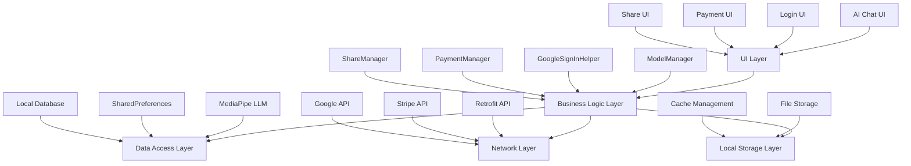

# Another-Me

**Intelligent AI Chat Application - Local AI Inference, Privacy-Safe, Feature-Rich**

[](https://developer.android.com/)
[](https://kotlinlang.org/)
[](LICENSE)
[]()

[中文文档](README_ANOTHERME.md) | [English Documentation](README_ANOTHERME_EN.md)

</div>

## 📱 Project Overview

Another-Me is an intelligent AI chat application based on the Android platform, integrating local AI model inference, multi-platform user authentication, subscription payment systems, and social media sharing features. The application adopts modern Android development architecture to provide users with a secure, private, and feature-rich AI conversation experience.

### 🎯 Core Values

- **🔒 Privacy & Security**: Local AI model inference, user data stays on device
- **⚡ High Performance**: Optimized inference engine based on MediaPipe
- **🌐 Multi-Platform**: Support for Google, Facebook, and other social logins
- **💳 Complete Payment**: Integrated Stripe payment system with subscription support
- **📤 Social Sharing**: Multi-platform content sharing functionality
- **🎨 Modern UI**: Streaming response display with elegant user interface

## ✨ Features

### 🤖 AI Chat System

- **Local AI Inference**: Uses MediaPipe LLM Inference for local model inference
- **Streaming Responses**: Real-time display of AI responses for enhanced user experience
- **Smart Fallback**: Automatically switches to simulated response mode when local model is unavailable
- **Token Management**: Intelligent token consumption calculation and billing system
- **Multi-turn Conversations**: Support for context-aware continuous conversations

### 🔐 User Authentication System

- **Google Login**: Uses the latest Credential Manager API
- **Secure Storage**: Local encrypted storage of user information
- **Auto Login**: Intelligent login status checking and automatic login
- **Multi-Account Support**: Support for multiple Google account switching

### 💰 Payment & Subscription System

- **Stripe Integration**: Uses PaymentSheet for secure payment processing
- **Multi-tier Subscriptions**: Basic, Premium, and Ultra Premium tiers
- **WebView Fallback**: Supports WebView payment as an alternative
- **Order Management**: Complete order creation and payment flow

### 📱 Social Media Sharing

- **Twitter Sharing**: Integrated Twitter SDK for tweet sharing
- **Facebook Sharing**: Integrated Facebook SDK for post sharing
- **Kakao Sharing**: Integrated Kakao SDK for KakaoTalk sharing
- **Unified Interface**: Provides unified sharing interface for easy integration

## 🏗️ Technical Architecture

### System Architecture Diagram



### Core Components

#### 1. AI Inference Engine

- **ModelManager**: Model lifecycle management
- **LlmInference**: MediaPipe LLM inference interface
- **SimulatedResponseManager**: Simulated response manager

#### 2. User Authentication

- **ANLoginActivity**: Google login main interface
- **GoogleSignInHelper**: User information management utility
- **CredentialManager**: Google authentication manager

#### 3. Payment System

- **ANSubscriptionActivity**: Subscription payment interface
- **Stripe SDK**: Payment processing service
- **PaymentSheet**: Payment interface component

#### 4. Network Communication

- **Retrofit**: HTTP client
- **RxJava**: Asynchronous programming framework
- **OkHttp**: Network request interceptor

## 🚀 Quick Start

### Requirements

- **Android Studio**: Arctic Fox 2020.3.1 or higher
- **JDK**: 1.8 or higher
- **Android SDK**: API 26 (Android 8.0) or higher
- **Gradle**: 8.11.0
- **Kotlin**: 1.9.25

### Installation Steps

1. **Clone the Project**
   
   ```bash
   git clone https://github.com/your-username/Another-Me.git
   cd Another-Me
   ```

2. **Configure Google Services**
   
   - Create a project in [Google Cloud Console](https://console.cloud.google.com/)
   - Enable Google Sign-In API
   - Download `google-services.json` file to `app/` directory

3. **Configure Stripe Payment**
   
   - Get API keys from [Stripe Dashboard](https://dashboard.stripe.com/)
   - Update `publishableKey` in `ANSubscriptionActivity.kt`

4. **Configure Social Media Sharing**
   
   - Register applications on respective platforms to get API keys
   - Update configurations in `AndroidManifest.xml`

5. **Build the Project**
   
   ```bash
   ./gradlew assembleDebug
   ```

### Running the Application

1. Connect an Android device or start an emulator
2. Click the run button in Android Studio
3. Or use command line:
   
   ```bash
   ./gradlew installDebug
   ```

## 📖 Detailed Feature Documentation

### AI Chat Functionality

#### Model Initialization

```kotlin
// Initialize model manager
val modelManager = ModelManager.getInstance(
    context = this,
    onModelReady = { isReady ->
        if (isReady) {
            // Model initialization successful, can start conversation
            startChat()
        } else {
            // Use simulated response mode
            useSimulatedMode()
        }
    },
    onModelError = { error ->
        Log.e("ModelManager", "Model initialization failed: $error")
    }
)

// Check and initialize model
modelManager.checkAndInitializeModel()
```

#### Sending Messages

```kotlin
private fun sendMessage(message: String) {
    if (useRealModel && modelManager.getLlmInference() != null) {
        // Use real model inference
        modelManager.executeInBackground {
            try {
                val response = modelManager.getLlmInference()?.generateResponse(message)
                // Handle response
                handleResponse(response)
            } catch (e: Exception) {
                // Error handling, switch to simulated mode
                switchToSimulatedMode()
            }
        }
    } else {
        // Use simulated response
        useSimulatedResponse(message)
    }
}
```

### User Authentication Functionality

#### Google Login

```kotlin
private fun signIn() {
    // Generate random nonce
    val rawNonce = UUID.randomUUID().toString()
    val hashedNonce = hashNonce(rawNonce)

    // Configure Google ID options
    val googleIdOption = GetGoogleIdOption.Builder()
        .setFilterByAuthorizedAccounts(false)
        .setServerClientId(webClientId)
        .setNonce(hashedNonce)
        .setAutoSelectEnabled(true)
        .build()

    // Create credential request
    val request = GetCredentialRequest.Builder()
        .addCredentialOption(googleIdOption)
        .build()

    // Start sign-in flow
    CoroutineScope(Dispatchers.Main).launch {
        try {
            val result = credentialManager.getCredential(request, this@ANLoginActivity)
            handleSignIn(result)
        } catch (e: GetCredentialException) {
            handleSignInFailure(e)
        }
    }
}
```

#### User Information Management

```kotlin
// Save user information
GoogleSignInHelper.saveUserInfo(
    context = this,
    idToken = idToken,
    userName = displayName,
    email = email,
    profilePicUrl = profilePicUrl
)

// Check login status
if (GoogleSignInHelper.isUserLoggedIn(this)) {
    val userName = GoogleSignInHelper.getUserName(this)
    // User is logged in
} else {
    // Navigate to login page
    startActivity(Intent(this, ANLoginActivity::class.java))
}
```

### Payment & Subscription Functionality

#### Create Order

```kotlin
private fun orderCreate(packageLevel: Int) {
    val uid = SharedPreferencesUtils.getString(
        TGDApplication.getApp(), 
        SharedPreferencesUtils.KEYS.USER_ID, 
        ""
    )

    val orderRequest = ANOrderResp().apply {
        this.uid = uid
        this.package_level = packageLevel
    }

    userService.orderCreate(orderRequest)
        .subscribeOn(Schedulers.io())
        .observeOn(AndroidSchedulers.mainThread())
        .subscribe(object : SubscriberResultCallback<BaseBean<ANOrderBean>>() {
            override fun onSuccess(obj: Any?) {
                val orderBean = obj as ANOrderBean
                if (!orderBean.client_secret.isNullOrEmpty()) {
                    // Use Stripe PaymentSheet
                    presentPaymentSheet(orderBean.client_secret)
                } else if (orderBean.payment_url.isNotEmpty()) {
                    // Use WebView payment
                    openWebViewPayment(orderBean.payment_url)
                }
            }
        })
}
```

#### Payment Processing

```kotlin
private fun presentPaymentSheet(clientSecret: String) {
    val configuration = PaymentSheet.Configuration(
        merchantDisplayName = "Another Me",
        allowsDelayedPaymentMethods = true
    )

    paymentSheet.presentWithPaymentIntent(clientSecret, configuration)
}

private fun onPaymentSheetResult(result: PaymentSheetResult) {
    when (result) {
        is PaymentSheetResult.Completed -> {
            // Payment successful
            Toast.makeText(this, "Payment successful!", Toast.LENGTH_SHORT).show()
            setResult(RESULT_OK)
            finish()
        }
        is PaymentSheetResult.Canceled -> {
            // User canceled payment
            Log.d("Payment", "User canceled payment")
        }
        is PaymentSheetResult.Failed -> {
            // Payment failed
            Toast.makeText(this, "Payment failed: ${result.error.message}", Toast.LENGTH_SHORT).show()
        }
    }
}
```

## ⚙️ Configuration Guide

### Google Login Configuration

1. **Create Google Cloud Project**
   
   - Visit [Google Cloud Console](https://console.cloud.google.com/)
   - Create a new project or select an existing one
   - Enable Google Sign-In API

2. **Configure OAuth 2.0 Client**
   
   - Create OAuth 2.0 client ID in the "Credentials" page
   - Add Android application package name: `com.another.network`
   - Add SHA-1 fingerprints (debug and release versions)

3. **Download Configuration File**
   
   - Download `google-services.json` file
   - Place it in the `app/` directory

### Stripe Payment Configuration

1. **Get API Keys**
   
   - Login to [Stripe Dashboard](https://dashboard.stripe.com/)
   - Get publishable key from "Developers" > "API keys"
   - Update `publishableKey` in `ANSubscriptionActivity.kt`

2. **Configure Webhook**
   
   - Configure webhook endpoint in Stripe Dashboard
   - Listen for `payment_intent.succeeded` events
   - Handle business logic after successful payment

### Social Media Sharing Configuration

#### Twitter Configuration

```xml
<!-- AndroidManifest.xml -->
<meta-data
    android:name="com.twitter.sdk.android.CONSUMER_KEY"
    android:value="YOUR_TWITTER_CONSUMER_KEY" />
<meta-data
    android:name="com.twitter.sdk.android.CONSUMER_SECRET"
    android:value="YOUR_TWITTER_CONSUMER_SECRET" />
```

#### Facebook Configuration

```xml
<!-- AndroidManifest.xml -->
<meta-data
    android:name="com.facebook.sdk.ApplicationId"
    android:value="@string/facebook_app_id" />
<meta-data
    android:name="com.facebook.sdk.ClientToken"
    android:value="@string/facebook_client_token" />
```

#### Kakao Configuration

```xml
<!-- AndroidManifest.xml -->
<meta-data
    android:name="com.kakao.sdk.AppKey"
    android:value="@string/kakao_app_key" />
```

## 🚀 Deployment Guide

### Building Release Version

1. **Configure Signing**
   
   ```gradle
   // app/build.gradle
   signingConfigs {
       release {
           keyAlias 'your_key_alias'
           keyPassword 'your_key_password'
           storeFile file('path/to/your/keystore.jks')
           storePassword 'your_store_password'
       }
   }
   
   buildTypes {
       release {
           signingConfig signingConfigs.release
           minifyEnabled true
           proguardFiles getDefaultProguardFile('proguard-android-optimize.txt'), 'proguard-rules.pro'
       }
   }
   ```

2. **Build APK**
   
   ```bash
   ./gradlew assembleRelease
   ```

3. **Build AAB (Recommended)**
   
   ```bash
   ./gradlew bundleRelease
   ```

### Publishing to Google Play

1. **Prepare Release Materials**
   
   - Application icons (various sizes)
   - Application screenshots
   - Application description
   - Privacy policy link

2. **Upload to Google Play Console**
   
   - Login to [Google Play Console](https://play.google.com/console/)
   - Create new application or select existing one
   - Upload AAB file
   - Fill in application information
   - Submit for review

## 🔧 Troubleshooting

### Common Issues

#### 1. Google Login Failed

**Issue**: "Sign-In failed" error when attempting Google login

**Solution**:

- Check if `google-services.json` file is configured correctly
- Verify SHA-1 fingerprint matches configuration in Google Cloud Console
- Ensure device has Google Play services installed

```bash
# Get SHA-1 fingerprint
keytool -list -v -keystore ~/.android/debug.keystore -alias androiddebugkey -storepass android -keypass android
```

#### 2. AI Model Initialization Failed

**Issue**: MediaPipe error during model initialization

**Solution**:

- Check if model file exists and is in correct format
- Ensure device has sufficient memory to run the model
- Check specific error information in logs

```kotlin
// Check model file
val modelFile = modelManager.checkModelExists()
if (modelFile != null) {
    Log.d("ModelManager", "Model file exists: ${modelFile.absolutePath}")
    Log.d("ModelManager", "File size: ${modelFile.length()} bytes")
} else {
    Log.e("ModelManager", "Model file does not exist")
}
```

#### 3. Stripe Payment Failed

**Issue**: "Payment failed" error during payment

**Solution**:

- Check if `publishableKey` is configured correctly
- Verify backend correctly returns `client_secret`
- Ensure network connection is stable

#### 4. Social Media Sharing Failed

**Issue**: Failed to share to social media platforms

**Solution**:

- Check if respective SDK configurations are correct
- Verify application is registered on corresponding platforms
- Ensure respective applications are installed on device

### Debugging Tips

#### Enable Detailed Logging

```kotlin
// Enable logging in Application class
if (BuildConfig.DEBUG) {
    Log.d("AnotherMe", "Debug mode enabled")
    // Enable other debugging features
}
```

#### Network Request Debugging

```kotlin
// Add logging interceptor in Retrofit
val loggingInterceptor = HttpLoggingInterceptor().apply {
    level = HttpLoggingInterceptor.Level.BODY
}

val client = OkHttpClient.Builder()
    .addInterceptor(loggingInterceptor)
    .build()
```

## 🤝 Contributing

### Development Environment Setup

1. **Fork the Project**
   
   - Fork this project on GitHub
   - Clone your fork to local

2. **Create Development Branch**
   
   ```bash
   git checkout -b feature/your-feature-name
   ```

3. **Commit Changes**
   
   ```bash
   git add .
   git commit -m "Add: Describe your changes"
   git push origin feature/your-feature-name
   ```

4. **Create Pull Request**
   
   - Create Pull Request on GitHub
   - Describe your changes and reasons in detail

### Code Standards

#### Kotlin Code Standards

- Use 4 spaces for indentation
- Use PascalCase for class names
- Use camelCase for function and variable names
- Use UPPER_SNAKE_CASE for constants

#### Commit Message Standards

- `Add:` New features
- `Fix:` Bug fixes
- `Update:` Update existing features
- `Remove:` Remove features
- `Refactor:` Code refactoring

### Testing Requirements

- New features must include unit tests
- UI changes require manual testing verification
- Ensure all existing tests pass

## 📄 License

This project is licensed under the MIT License - see the [LICENSE](LICENSE) file for details.

## 📞 Contact Us

- **Project Homepage**: [https://github.com/your-username/Another-Me](https://github.com/your-username/Another-Me)
- **Issue Reports**: [Issues](https://github.com/your-username/Another-Me/issues)
- **Email**: your-email@example.com

## 🙏 Acknowledgments

Thanks to the following open source projects and services:

- [MediaPipe](https://mediapipe.dev/) - AI inference framework
- [Stripe](https://stripe.com/) - Payment processing service
- [Google Sign-In](https://developers.google.com/identity) - User authentication
- [Retrofit](https://square.github.io/retrofit/) - Network request library
- [RxJava](https://github.com/ReactiveX/RxJava) - Reactive programming

---

<div align="center">

**If this project helps you, please give it a ⭐️**

Made with ❤️ by [Your Name](https://github.com/your-username)

</div>